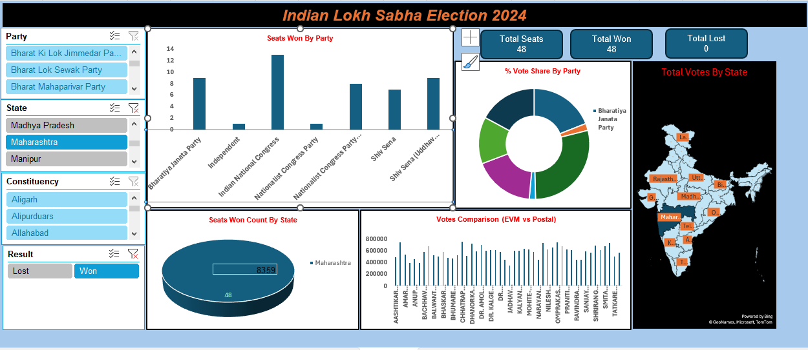

# excel-project-Indian-Lokh-Sabha-Election-2024

**Indian Lok Sabha Election 2024 – Excel Dashboard**  
📌 **Project Overview**  
This project presents an interactive Indian Lok Sabha Election 2024 Dashboard built using Microsoft Excel.  
The dashboard analyzes election results including party-wise seat distribution, vote share percentage, state-wise performance, and EVM vs Postal vote comparison  
The objective of this project is to transform raw election data into clear, structured, and insightful visual reports using Excel.  

🎯 Project Objectives  

* Analyze seats won by each political party
* Visualize vote share percentage by party
* Compare EVM votes vs Postal votes
* Track state-wise total votes
* Enable filtering by Party, State, Constituency, and Result

🛠 **Tools & Excel Features Used**

* Microsoft Excel
* Pivot Tables
* Pivot Charts
* Slicers
* Data Cleaning & Formatting
* Conditional Formatting
* Dashboard Design & Layout

📊 **Dashboard Features**
🔹 **Key Metrics**

* Total Seats: 8902
* Total Won Seats: 543
* Total Lost Seats: 8359

🔹 **Visualizations Included**

* Seats Won by Party (Bar Chart)
* Vote Share by Party (Donut Chart)
* Seats Won by State (Pie Chart)
* Total Votes by State (Map)
* EVM vs Postal Votes Comparison (Column Chart)

🔹 **Interactive Filters**

* Party
* State
* Constituency
* Result (Won / Lost)

📈 **Key Insights** 

* Major national parties dominate seat distribution.
* Some states show strong regional party influence.
* Vote share percentage does not always equal seat share.
* Differences observed between EVM and Postal votes in select constituencies.

🚀 **How to Use**

* Download the Excel file from this repository
* Open in Microsoft Excel
* Use slicers to filter data dynamically
* Interact with charts for insights

📸 Dashboard Preview

