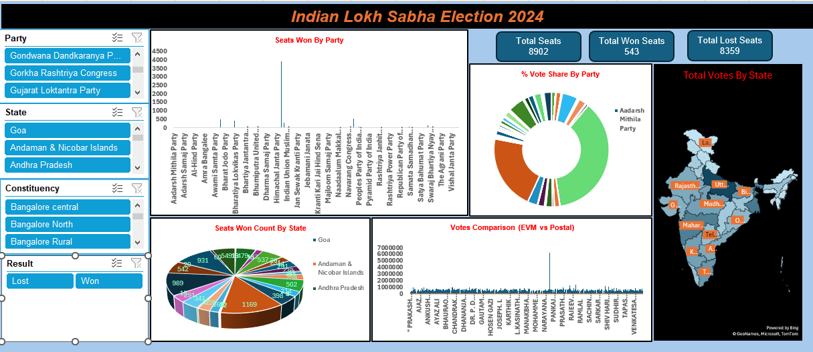
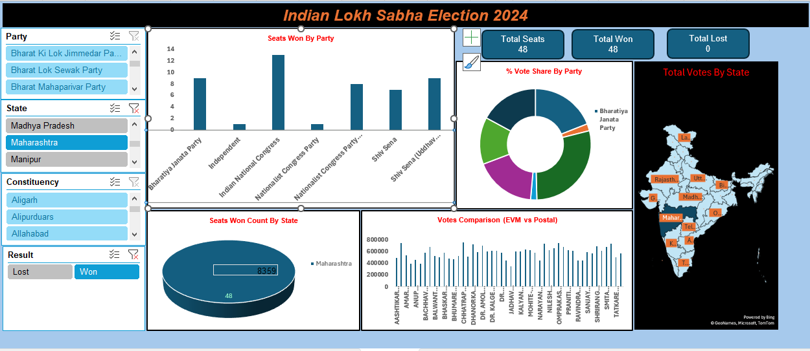

# 🗳️ Indian Lok Sabha Election 2024 – Excel Dashboard

An interactive data visualization project built using Microsoft Excel to analyze and present insights from the Indian Lok Sabha Election 2024 results.

---

## 📌 Project Overview

The **Indian Lok Sabha Election 2024 Dashboard** is a dynamic Excel-based reporting solution designed to analyze election data in a structured and visual format.

This dashboard transforms raw election data into meaningful insights by showcasing:

- Party-wise seat distribution  
- Vote share percentage  
- State-wise performance  
- EVM vs Postal vote comparison  

The objective of this project is to demonstrate how Microsoft Excel can be used as a powerful business intelligence tool for data analysis and dashboard creation.

---

## 🎯 Project Objectives

- Analyze total seats won by each political party  
- Visualize vote share percentage distribution  
- Compare EVM votes vs Postal votes  
- Track total votes state-wise  
- Enable interactive filtering by Party, State, Constituency, and Result  

---

## 🛠 Tools & Excel Features Used

- Microsoft Excel  
- Pivot Tables  
- Pivot Charts  
- Slicers  
- Data Cleaning & Formatting  
- Conditional Formatting  
- Dashboard Design & Layout  

---

## 📊 Dashboard Features

### 🔹 Key Metrics

- **Total Records:** 8902  
- **Total Won Seats:** 543  
- **Total Lost Seats:** 8359  

---

### 🔹 Visualizations Included

- Seats Won by Party (Bar Chart)  
- Vote Share by Party (Donut Chart)  
- Seats Won by State (Pie Chart)  
- Total Votes by State (Map Chart)  
- EVM vs Postal Votes Comparison (Column Chart)  

---

### 🔹 Interactive Filters

The dashboard includes dynamic slicers for:

- Party  
- State  
- Constituency  
- Result (Won / Lost)  

These filters allow users to interact with the dashboard and generate customized insights instantly.

---

## 📈 Key Insights

- Major national parties dominate overall seat distribution.  
- Certain states show strong influence of regional political parties.  
- Vote share percentage does not always translate into equivalent seat share.  
- Noticeable differences observed between EVM and Postal votes in select constituencies.  

---

## 🚀 How to Use

1. Download the Excel file from this repository  
2. Open the file in Microsoft Excel  
3. Use slicers to filter data dynamically  
4. Interact with charts to explore insights  

---

## 📸 Dashboard Preview

---

## 🎯 Project Objective (Summary)

To design a structured and interactive election analysis dashboard using Excel that converts complex electoral data into simple, clear, and actionable visual insights.

---

## 👨‍💻 Author

**Vipul Alsundkar**  
Data & BI Enthusiast  
